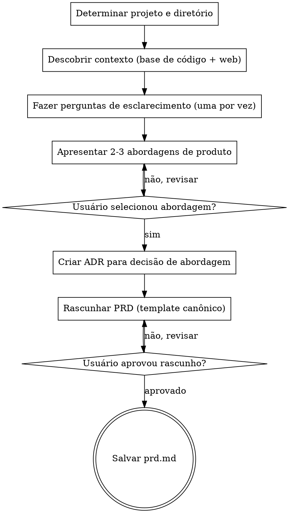

# Criar PRD

Crie um Documento de Requisitos de Produto focado em negócio por meio de brainstorming estruturado.

<HARD-GATE>
NÃO escreva o arquivo do PRD até que TODAS as fases estejam completas e o usuário tenha aprovado o rascunho final.
NÃO pule a fase de pesquisa — todo PRD DEVE ser enriquecido com contexto da base de código e do mercado.
NÃO pule as interações com o usuário — o usuário DEVE participar na construção do PRD em cada ponto de decisão.
NÃO exija aprovação seção por seção — gere o rascunho completo e deixe o usuário revisá-lo.
Isso se aplica a TODO PRD independentemente da complexidade percebida.
</HARD-GATE>

## Fazendo Perguntas

Quando esta skill instruir você a fazer uma pergunta ao usuário, você DEVE usar a ferramenta de questão interativa dedicada do seu runtime — a ferramenta ou função que apresenta uma pergunta ao usuário e **pausa a execução até que o usuário responda**. Não gere perguntas como texto simples do assistente e continue gerando; sempre use o mecanismo que bloqueia até que o usuário tenha respondido.

Se o seu runtime não fornecer tal ferramenta, apresente a pergunta como sua mensagem completa e pare de gerar. Não responda sua própria pergunta nem prossiga sem a contribuição do usuário.

## Anti-Padrão: "Esta Funcionalidade É Simples Demais para Brainstorming Completo"

Todo PRD passa pelo processo completo de brainstorming. Um único botão, um pequeno ajuste de fluxo de trabalho, uma opção de configuração — todos eles. Funcionalidades "simples" são onde suposições de negócio não examinadas causam mais retrabalho. O brainstorming pode ser breve para funcionalidades genuinamente simples, mas você DEVE fazer perguntas de esclarecimento e obter aprovação na abordagem do produto antes de escrever o artefato.

## Anti-Padrão: Burocracia no Final do Fluxo

Assim que o usuário responder as perguntas de esclarecimento e aprovar uma abordagem, não force-o por um segundo ciclo de aprovação para Visão Geral, Objetivos, Histórias de Usuário ou qualquer outra seção do documento final. Sintetize a direção aprovada diretamente no PRD. O usuário pode revisar e solicitar edições no arquivo gerado depois.

## Anti-Padrão: Desvio Técnico em Funcionalidades com Nomes Técnicos

Quando o nome da funcionalidade soa técnico (ex.: "notificações por webhook", "exportação CSV", "modo escuro", "limitação de taxa da API"), você será tentado a discutir COMO implementá-la. Resista a isso. Seu trabalho é o QUÊ e o PORQUÊ:

- ERRADO: "Devemos usar WebSockets ou polling para notificações?" (implementação)
- ERRADO: "Qual formato de biblioteca CSV devemos usar?" (implementação)
- CERTO: "Quais eventos devem disparar uma notificação para o usuário?" (necessidade do usuário)
- CERTO: "Que informações os usuários precisam em seus relatórios exportados?" (necessidade do usuário)

Traduza cada funcionalidade de nome técnico para a pergunta de experiência do usuário por trás dela.

## Entradas Necessárias

- Nome da funcionalidade ou ideia de produto.
- Opcional: arquivo `_idea.md` existente como entrada principal para contexto.
- Opcional: arquivo `prd.md` existente para modo de atualização.

## Checklist

Você DEVE criar uma tarefa para cada fase e completá-las em ordem:

1. **Determinar projeto e diretório** — derivar `<ticket>-<slug>`, criar `../ppov-docs/issues/front/<ticket>-<slug>/` e `adrs/`
2. **Descobrir contexto** — exploração paralela da base de código e pesquisa web
3. **Entender a necessidade** — fazer 3-6 perguntas direcionadas para refinar escopo e intenção
4. **Apresentar abordagens de produto** — oferecer 2-3 abordagens com trade-offs, criar ADR para a escolhida
5. **Rascunhar o PRD** — escrever usando o template canônico de `references/prd-template.md`
6. **Revisar com o usuário** — apresentar o rascunho, iterar até aprovação
7. **Salvar o arquivo** — escrever em `../ppov-docs/issues/front/<ticket>-<slug>/prd.md`

## Fluxo de Trabalho

1. Determinar o nome do projeto e o diretório de trabalho.
   - Derivar o `<ticket>` a partir do prefixo numérico da branch git atual (ex.: branch `1796-feature-x` → ticket `1796`). Se a branch não tiver prefixo numérico, perguntar o número do ticket ao usuário.
   - Derivar o `<slug>` a partir do nome da funcionalidade fornecido pelo usuário.
   - Usar `../ppov-docs/issues/front/<ticket>-<slug>/` (caminho relativo à raiz do checkout de `ppov-front-vue3`, nunca absoluto — o `ppov-docs` deve estar clonado como pasta irmã) como diretório alvo.
   - Se `_idea.md` existir no diretório alvo, lê-lo como entrada de contexto principal.
   - Se `prd.md` já existir no diretório alvo, lê-lo e operar em modo de atualização.
   - Se o diretório não existir, criá-lo.
   - Criar o diretório `../ppov-docs/issues/front/<ticket>-<slug>/adrs/` se não existir.

2. Descobrir contexto por meio de pesquisa paralela. Você DEVE realizar AMBAS as trilhas antes de fazer qualquer pergunta.

   **Trilha A — Exploração da base de código** (OBRIGATÓRIO):
   - Pesquisar na base de código arquivos, padrões e funcionalidades relacionados à solicitação do usuário.
   - Procurar implementações existentes, modelos de dados e pontos de integração relevantes.
   - Resumir o que encontrou em 3-5 pontos.

   **Trilha B — Pesquisa de mercado e usuário** (OBRIGATÓRIO):
   - Realizar 3-5 pesquisas web sobre tendências de mercado, produtos concorrentes e necessidades dos usuários relacionadas à funcionalidade.
   - Procurar como produtos similares resolvem esse problema e o que os usuários esperam.
   - Resumir o que encontrou em 3-5 pontos.

   Execute ambas as trilhas em paralelo (ex.: duas chamadas de Agent, dois lotes de pesquisa, etc.). Apresente um breve resumo integrado dos achados de AMBAS as trilhas ao usuário antes de passar para as perguntas. Se ferramentas de pesquisa web não estiverem disponíveis, note a limitação explicitamente e prossiga apenas com os achados da base de código.

3. Fazer perguntas de esclarecimento seguindo `references/question-protocol.md`.
   - Focar exclusivamente em QUAIS funcionalidades os usuários precisam, POR QUÊ isso fornece valor de negócio, e QUEM são os usuários-alvo.
   - Perguntar sobre critérios de sucesso e restrições.
   - Nunca fazer perguntas técnicas de implementação sobre bancos de dados, APIs, frameworks ou arquitetura.
   - **UMA pergunta por mensagem — estritamente aplicado.** Sua mensagem deve conter exatamente um ponto de interrogação. Após fazer a pergunta, PARE. Não adicione perguntas de acompanhamento, perguntas "também" ou solicitações "adicionalmente". Se um tópico precisar de mais exploração, faça um acompanhamento na PRÓXIMA mensagem após o usuário responder.

     Anti-padrão (PROIBIDO):
     "Qual é a persona principal do usuário? Também, quais são as métricas principais de sucesso?"
     Isso são DUAS perguntas. Divida-as em duas mensagens separadas.

   - Toda pergunta DEVE ser de múltipla escolha quando opções razoáveis podem ser predeterminadas. Formate como opções rotuladas (A, B, C, etc.) para que o usuário possa responder com uma única letra. Use perguntas abertas apenas quando o espaço de resposta é genuinamente ilimitado (ex.: "Qual problema você está tentando resolver?").
   - Inclua uma opção de reserva (ex.: "D) Outro — descreva") para flexibilidade.
   - Para funcionalidades complexas com muitas dimensões, decomponha em subtópicos e pergunte sobre uma dimensão por vez. Cada subtópico geralmente tem opções predetermináveis. Exemplo: em vez de "O que a funcionalidade de colaboração deve incluir?" (aberta), pergunte "Qual aspecto da colaboração em equipe é mais importante para começar? A) Espaços de trabalho compartilhados B) Presença em tempo real C) Controles de permissão D) Feeds de atividade".
   - Completar pelo menos uma rodada completa de esclarecimento antes de apresentar abordagens.

4. Apresentar abordagens de produto.
   - Oferecer 2-3 abordagens de produto com trade-offs para cada uma.
   - Liderar com a abordagem recomendada e explicar por que é preferida.
   - Aguardar o usuário selecionar uma abordagem antes de continuar.
   - Após o usuário selecionar uma abordagem, criar um ADR para esta decisão:
     - Ler `references/adr-template.md`.
     - Determinar o próximo número de ADR listando arquivos existentes em `../ppov-docs/issues/front/<ticket>-<slug>/adrs/`.
     - Preencher o template: a abordagem selecionada como "Decisão", abordagens rejeitadas como "Alternativas Consideradas" com seus trade-offs, e resultados como "Consequências". Definir Status como "Aceito" e Data como hoje.
     - Escrever o ADR em `../ppov-docs/issues/front/<ticket>-<slug>/adrs/adr-NNN.md` (número de 3 dígitos com zero à esquerda, ex.: `adr-001.md`).

5. Rascunhar o PRD.
   - Após o usuário selecionar uma abordagem, sintetize o design final do produto. Não apresente cada seção para aprovação separada.
   - Se o usuário tomar uma decisão significativa de escopo durante o esclarecimento ou seleção de abordagem, crie um ADR adicional seguindo o mesmo processo do passo 4.
   - Só pause antes de escrever se uma ambiguidade bloqueante permanecer que forçaria adivinhação; caso contrário prossiga diretamente para a geração do documento.
   - Ler `references/prd-template.md` e preencher cada seção com o contexto coletado.
   - Incluir uma seção "Architecture Decision Records" listando todos os ADRs criados durante esta sessão com seus números, títulos e resumos de uma linha como links para o diretório `adrs/`.
   - Aplicar YAGNI rigorosamente: questionar cada funcionalidade e remover qualquer coisa que o MVP não precise.
   - O PRD deve descrever apenas capacidades do usuário e resultados de negócio.
   - Sem bancos de dados, APIs, estrutura de código, frameworks, estratégias de teste ou decisões de arquitetura.
   - Seções obrigatórias (SEMPRE incluir): Visão Geral, Objetivos, Histórias de Usuário, Funcionalidades Principais, Experiência do Usuário, Fora do Escopo, Plano de Lançamento em Fases, Métricas de Sucesso, Riscos e Mitigações, Architecture Decision Records, Perguntas em Aberto.
   - Seções opcionais (incluir quando relevante): Restrições Técnicas de Alto Nível.
   - Prefira voz ativa, omita palavras desnecessárias, use linguagem definitiva e específica em vez de generalidades vagas. Cada frase deve merecer seu lugar.
   - Idioma: **Inglês**. Tom: claro, técnico, consistente com os artefatos existentes do projeto.
   - Apresentar o rascunho completo ao usuário para revisão.

6. Revisar com o usuário.
   - Apresentar o rascunho e perguntar usando a ferramenta de questão interativa:
     - "Aqui está o rascunho do PRD. Por favor, revise e me informe:"
     - A) Aprovado — salvar como está
     - B) Ajustar seções específicas (me diga quais)
     - C) Reescrever a seção X (me diga o que mudar)
     - D) Descartar e começar de novo
   - Se B ou C: fazer as alterações e apresentar novamente.
   - Se D: voltar ao passo 3.

7. Salvar o arquivo do PRD.
   - Escrever o documento completo em `../ppov-docs/issues/front/<ticket>-<slug>/prd.md`.
   - Confirmar o caminho do arquivo ao usuário.
   - Lembrar ao usuário que o próximo passo é criar um TechSpec usando `cy-create-techspec` a partir deste PRD.

## Fluxo do Processo

## Tratamento de Erros

- Se o usuário fornecer contexto insuficiente para completar uma seção, note-a na seção de Perguntas em Aberto em vez de adivinhar.
- Se ferramentas de pesquisa web não estiverem disponíveis, prossiga apenas com exploração da base de código e note a limitação.
- Se o diretório alvo não puder ser criado, pare e reporte o erro do sistema de arquivos.
- Se estiver operando em modo de atualização, preserve as seções que o usuário não pediu para alterar.

## Princípios Chave

- **Uma pergunta por vez** — Não sobrecarregue com múltiplas perguntas em uma única mensagem
- **Múltipla escolha obrigatória** — Toda pergunta DEVE ser de múltipla escolha (A/B/C) quando as opções podem ser predeterminadas; aberta apenas quando o espaço de resposta é genuinamente ilimitado
- **YAGNI rigorosamente** — Questione cada funcionalidade; remova tudo que o MVP não precise
- **Rascunho depois revisão** — Obtenha aprovação na abordagem do produto, gere o rascunho completo e, então, itere com o usuário até aprovação
- **Foco em negócio apenas** — Nunca pergunte sobre implementação; isso pertence ao TechSpec
- **Ideia como entrada** — Quando `_idea.md` existir, use-o como contexto principal para acelerar o brainstorming
- **Consciência do pipeline** — O PRD alimenta `cy-create-techspec`; foque no QUÊ e no PORQUÊ, não no COMO
- **Conformidade com template** — Todo PRD DEVE seguir o template canônico
- **Consistência de idioma** — Escreva todo o conteúdo do PRD em inglês
