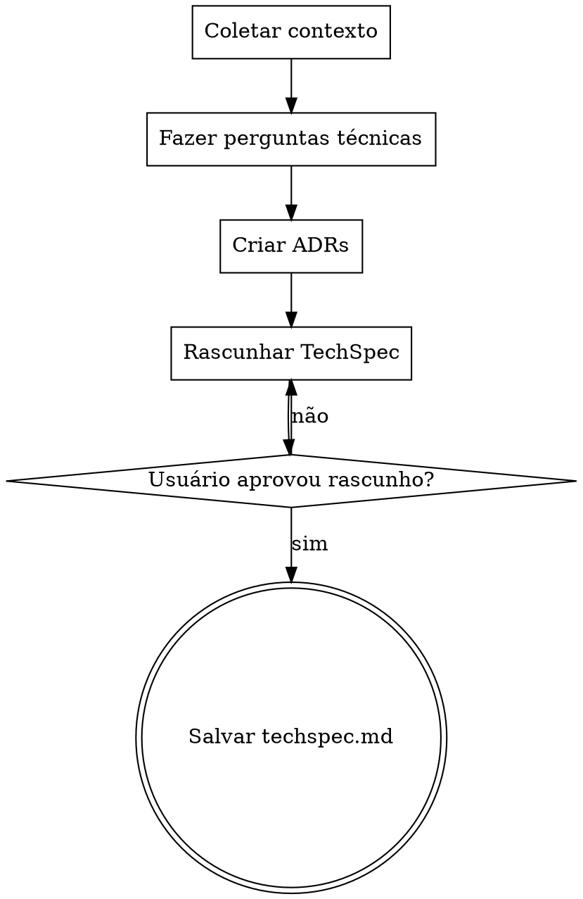

# Criar TechSpec

Traduza requisitos de negócio em uma especificação técnica detalhada.

<HARD-GATE>
NÃO escreva o arquivo do TechSpec até que TODAS as fases estejam completas e o usuário tenha aprovado o rascunho final.
NÃO pule a exploração da base de código — todo TechSpec DEVE ser informado pela arquitetura existente.
NÃO pule as interações com o usuário — o usuário DEVE participar na construção do TechSpec em cada ponto de decisão.
NÃO exija aprovação seção por seção — gere o rascunho completo e deixe o usuário revisá-lo.
Isso se aplica a TODO TechSpec independentemente da complexidade percebida.
</HARD-GATE>

## Fazendo Perguntas

Quando esta skill instruir você a fazer uma pergunta ao usuário, você DEVE usar a ferramenta de questão interativa dedicada do seu runtime — a ferramenta ou função que apresenta uma pergunta ao usuário e **pausa a execução até que o usuário responda**. Não gere perguntas como texto simples do assistente e continue gerando; sempre use o mecanismo que bloqueia até que o usuário tenha respondido.

Se o seu runtime não fornecer tal ferramenta, apresente a pergunta como sua mensagem completa e pare de gerar. Não responda sua própria pergunta nem prossiga sem a contribuição do usuário.

## Anti-Padrão: "Isso É Simples Demais para Precisar de Revisão de Design Técnico"

Todo TechSpec passa pelo processo completo de revisão de design. Um único endpoint, uma pequena refatoração, uma mudança de configuração — todos eles. Mudanças técnicas "simples" são onde suposições não examinadas sobre a arquitetura existente causam mais falhas de integração. A revisão de design pode ser breve para mudanças genuinamente simples, mas você DEVE fazer perguntas de esclarecimento técnico e obter aprovação na abordagem técnica antes de escrever o artefato.

## Anti-Padrão: Burocracia no Final do Fluxo

Assim que o usuário responder as perguntas de esclarecimento técnico e aprovar uma abordagem, não force-o por um segundo ciclo de aprovação para Arquitetura do Sistema, Modelos de Dados, Design de API ou outras seções do documento final. Sintetize a direção aprovada diretamente no TechSpec. O usuário pode revisar e solicitar edições no arquivo gerado depois.

## Entradas Necessárias

- Nome da funcionalidade identificando o diretório `./docs/<ticket>-<nome>/`.
- Opcional: `prd.md` existente como entrada principal.
- Opcional: `techspec.md` existente para modo de atualização.

## Checklist

Você DEVE criar uma tarefa para cada fase e completá-las em ordem:

1. **Coletar contexto** — ler PRD, ADRs e explorar arquitetura da base de código
2. **Fazer perguntas técnicas** — 3-6 perguntas direcionadas sobre arquitetura, modelos de dados, APIs, testes
3. **Criar ADRs** — registrar decisões técnicas significativas (padrão de arquitetura, escolhas de tecnologia, abordagem do modelo de dados)
4. **Rascunhar o TechSpec** — escrever usando o template canônico de `references/techspec-template.md`
5. **Revisar com o usuário** — apresentar o rascunho, iterar até aprovação
6. **Salvar o arquivo** — escrever em `./docs/<ticket>-<nome>/techspec.md`

## Fluxo de Trabalho

1. Coletar contexto.
   - Derivar o `<ticket>` a partir do prefixo numérico da branch git atual (ex.: branch `1796-feature-x` → ticket `1796`). Se a branch não tiver prefixo numérico, perguntar o número do ticket ao usuário.
   - Verificar se existe `prd.md` em `./docs/<ticket>-<nome>/`. Se existir, lê-lo como entrada principal.
   - Se não existir PRD, pedir ao usuário uma descrição do que precisa de especificação técnica.
   - Ler ADRs existentes de `./docs/<ticket>-<nome>/adrs/` para entender decisões já tomadas durante a criação do PRD.
   - Criar o diretório `./docs/<ticket>-<nome>/adrs/` se não existir.
   - Criar uma chamada de Agent para explorar a base de código em busca de padrões de arquitetura, componentes existentes, dependências e stack tecnológico.
   - Se `techspec.md` já existir, lê-lo e operar em modo de atualização.

2. Fazer perguntas de esclarecimento técnico.
   - Focar em COMO implementar, ONDE os componentes ficam e QUAIS tecnologias usar.
   - Cobrir abordagem de arquitetura e limites de componentes.
   - Cobrir modelos de dados e escolhas de armazenamento.
   - Cobrir design de API e pontos de integração.
   - Cobrir estratégia de testes e requisitos de desempenho.
   - Fazer apenas uma pergunta por mensagem. Se um tópico precisar de mais exploração, dividi-lo em uma sequência de perguntas individuais.
   - Preferir perguntas de múltipla escolha quando as opções puderem ser predeterminadas.
   - Incluir uma opção de reserva (ex.: "D) Outro — descreva") para flexibilidade.

3. Criar ADRs para decisões técnicas significativas.
   - Para cada decisão significativa (padrão de arquitetura escolhido, tecnologia selecionada, abordagem do modelo de dados, etc.):
     - Ler `references/adr-template.md`.
     - Determinar o próximo número de ADR listando arquivos existentes em `./docs/<ticket>-<nome>/adrs/`.
     - Preencher o template: o design escolhido como "Decisão", alternativas rejeitadas como "Alternativas Consideradas", e trade-offs como "Consequências". Definir Status como "Aceito" e Data como hoje.
     - Escrever cada ADR em `./docs/<ticket>-<nome>/adrs/adr-NNN.md` (número sequencial de 3 dígitos com zero à esquerda).

4. Rascunhar o TechSpec.
   - Ler `references/techspec-template.md` e preencher cada seção aplicável.
   - **OBRIGATÓRIO — Seção Architecture Decision Records:** O TechSpec gerado DEVE terminar com uma seção "Architecture Decision Records" listando todos os ADRs criados durante este processo. Cada entrada deve incluir o número do ADR (ex.: ADR-001), título e um resumo de uma linha formatado como link para o diretório `adrs/`. Mesmo funcionalidades simples requerem pelo menos um ADR documentando a abordagem técnica principal escolhida e alternativas rejeitadas. Se nenhum ADR foi criado no passo 3, volte e crie pelo menos um antes de gerar o documento.
   - Aplicar YAGNI rigorosamente: remover qualquer componente, interface ou abstração que não seja estritamente necessário. NÃO propor novos pacotes ou diretórios quando a funcionalidade puder ser implementada adicionando um único arquivo a um pacote existente.
   - Todo objetivo do PRD e história de usuário deve mapear para um componente técnico.
   - Referenciar seções do PRD pelo nome, mas não duplicar contexto de negócio.
   - Incluir exemplos de código apenas para interfaces principais, limitados a 20 linhas cada. A seção de Interfaces Principais deve conter pelo menos uma definição de TypeScript interface/type como bloco de código, mesmo para funcionalidades simples — mostrar o tipo principal do qual outros componentes dependerão.
   - A seção de Sequenciamento de Desenvolvimento DEVE incluir uma Ordem de Build numerada onde cada passo após o primeiro declara explicitamente de quais passos anteriores depende.
   - Prefira voz ativa, omita palavras desnecessárias, use linguagem definitiva e específica em vez de generalidades vagas. Cada frase deve merecer seu lugar.
   - Idioma: **Inglês**. Tom: claro, técnico, consistente com os artefatos existentes do projeto.
   - Apresentar o rascunho completo ao usuário para revisão.

5. Revisar com o usuário.
   - Apresentar o rascunho e perguntar usando a ferramenta de questão interativa:
     - "Aqui está o rascunho do TechSpec. Por favor, revise e me informe:"
     - A) Aprovado — salvar como está
     - B) Ajustar seções específicas (me diga quais)
     - C) Reescrever a seção X (me diga o que mudar)
     - D) Descartar e começar de novo
   - Se B ou C: fazer as alterações e apresentar novamente.
   - Se D: voltar ao passo 2.

6. Salvar o arquivo do TechSpec.
   - Escrever o documento completo em `./docs/<ticket>-<nome>/techspec.md`.
   - Confirmar o caminho do arquivo ao usuário.
   - Lembrar ao usuário que o próximo passo é criar tarefas usando `cy-create-tasks` a partir deste TechSpec.

## Fluxo do Processo

## Tratamento de Erros

- Se o PRD estiver faltando, prosseguir com o contexto fornecido pelo usuário e notar a ausência no Resumo Executivo.
- Se a exploração da base de código revelar padrões arquiteturais conflitantes, documentar ambos e recomendar um com justificativa.
- Se o usuário rejeitar a proposta de design, incorporar todo o feedback e apresentar uma proposta revisada.
- Se o diretório alvo não existir, criá-lo.
- Se estiver operando em modo de atualização, preserve as seções que o usuário não pediu para alterar.

## Princípios Chave

- **Uma pergunta por vez** — Não sobrecarregue com múltiplas perguntas em uma única mensagem
- **Múltipla escolha preferida** — Mais fácil para os usuários responderem do que perguntas abertas quando possível
- **YAGNI rigorosamente** — Remova componentes, abstrações e interfaces desnecessárias de todos os designs
- **Rascunho depois revisão** — Gere o rascunho completo do TechSpec primeiro, depois itere com o usuário até aprovação
- **Foco técnico apenas** — Nunca faça perguntas de negócio; isso pertence ao PRD
- **Trade-offs são obrigatórios** — Todo Resumo Executivo deve declarar o principal trade-off técnico da abordagem escolhida
- **PRD como entrada** — Quando `prd.md` existir, use-o como contexto principal; todo objetivo do PRD deve mapear para um componente técnico
- **Consciência do pipeline** — O TechSpec alimenta `cy-create-tasks`; foque no COMO, não no QUÊ ou no PORQUÊ
- **Conformidade com template** — Todo TechSpec DEVE seguir o template canônico
- **Consistência de idioma** — Escreva todo o conteúdo do TechSpec em inglês
