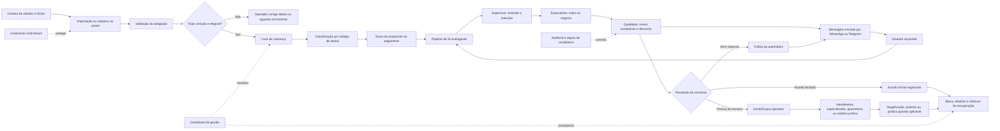
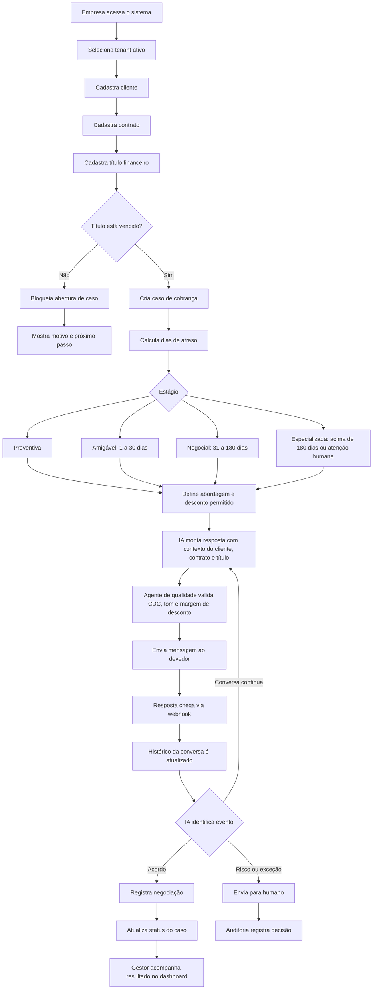
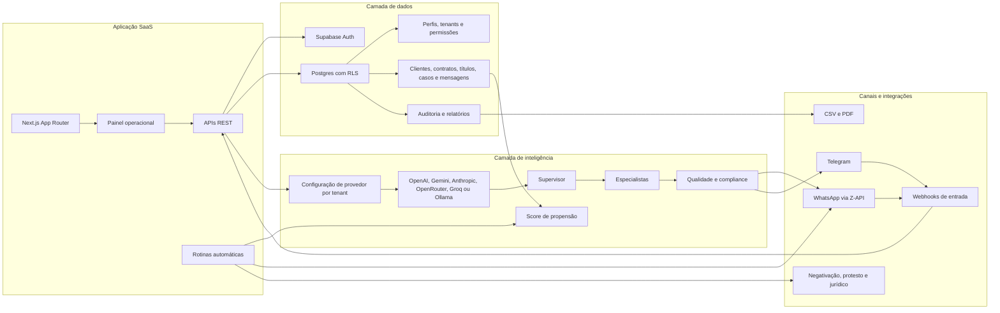
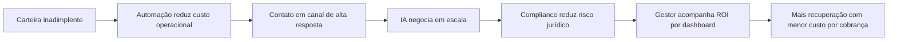

# Fluxograma para Investidor: Solução de Cobrança IA

## Resumo executivo

A Solução de Cobrança IA automatiza o ciclo de recuperação de crédito: recebe carteiras de inadimplência, identifica títulos elegíveis, abre casos de cobrança, conduz negociações por IA em canais como WhatsApp e Telegram, registra acordos, aciona atendimento humano quando necessário e entrega indicadores de recuperação para gestão.

O diferencial do produto é combinar **automação conversacional**, **políticas de cobrança configuráveis**, **compliance auditável**, **multi-tenant para escala B2B** e **inteligência preditiva** para priorizar os casos com maior chance de recuperação.

## Fluxograma executivo

## Fluxo operacional do caso

## Arquitetura simplificada

## Fluxo de valor para o investidor

## Como apresentar em 60 segundos

Esta plataforma transforma cobrança em um processo automatizado, rastreável e escalável. A empresa importa sua carteira, o sistema identifica quais títulos podem ser cobrados e abre casos com todo o contexto financeiro. A IA conversa com o devedor por WhatsApp ou Telegram, negocia dentro das políticas de desconto da empresa e passa por uma camada de qualidade para evitar abuso, ameaça ou proposta fora da margem. Quando há acordo, o sistema registra a negociação; quando há exceção, transfere para um operador humano ou para etapas como quarentena, negativação, protesto e jurídico. Tudo fica isolado por empresa, auditado e medido em dashboards, permitindo vender a solução como SaaS para assessorias, fintechs, varejo, instituições de ensino e qualquer negócio com alto volume de inadimplência.

## Pontos de destaque para o pitch

- **Problema grande:** cobrança tradicional é cara, manual, difícil de escalar e pouco eficiente em canais frios.
- **Solução clara:** negociação automatizada por IA em canais com alto engajamento, especialmente WhatsApp.
- **Escala B2B:** arquitetura multi-tenant permite atender várias empresas com isolamento de dados.
- **Governança:** políticas, limites de desconto, auditoria e revisão de compliance reduzem risco operacional.
- **Diferencial técnico:** pipeline multiagente com supervisor, especialistas e qualidade, em vez de um chatbot simples.
- **Inteligência de carteira:** score de propensão e estágios de atraso ajudam a priorizar onde há mais chance de recuperação.
- **Expansão natural:** relatórios, campanhas, templates, notificações, negativação, protesto e jurídico aumentam ticket e retenção.

## Legenda dos principais módulos

| Módulo | Papel no negócio |
| --- | --- |
| Dashboard | Mostra volume, status dos casos, acordos e indicadores de recuperação. |
| Clientes, contratos e títulos | Organizam a cadeia financeira que dá origem à cobrança. |
| Casos de cobrança | Centralizam conversa, status, valores, estágio, responsável e histórico. |
| IA multiagente | Decide abordagem, negocia e valida conformidade antes de responder. |
| Mensageria | Envia e recebe mensagens por WhatsApp ou Telegram. |
| Políticas e templates | Padronizam régua de cobrança, tom, descontos e fallback quando a IA falha. |
| Auditoria | Registra ações críticas para rastreabilidade e compliance. |
| Relatórios | Exportam informações para gestão financeira e análise de ROI. |
| Rotinas automáticas | Executam follow-up, score, alerta, negativação, protesto e expiração de negociações. |
| Multi-tenant | Permite vender o produto para múltiplas empresas com dados isolados. |

## Sugestão de slide

1. **Slide 1: Dor e oportunidade**
   Mostre alto custo de cobrança manual, baixa escala e necessidade de recuperar receita sem prejudicar relacionamento.

2. **Slide 2: Fluxograma executivo**
   Use o primeiro diagrama como visão central do produto.

3. **Slide 3: Diferencial da IA**
   Explique o pipeline supervisor, especialista e qualidade.

4. **Slide 4: Modelo SaaS e defensabilidade**
   Destaque multi-tenant, integrações, auditoria, dados históricos e score de propensão.

5. **Slide 5: Expansão de receita**
   Mostre módulos futuros ou avançados: campanhas, negativação, protesto, jurídico, relatórios e integrações.
